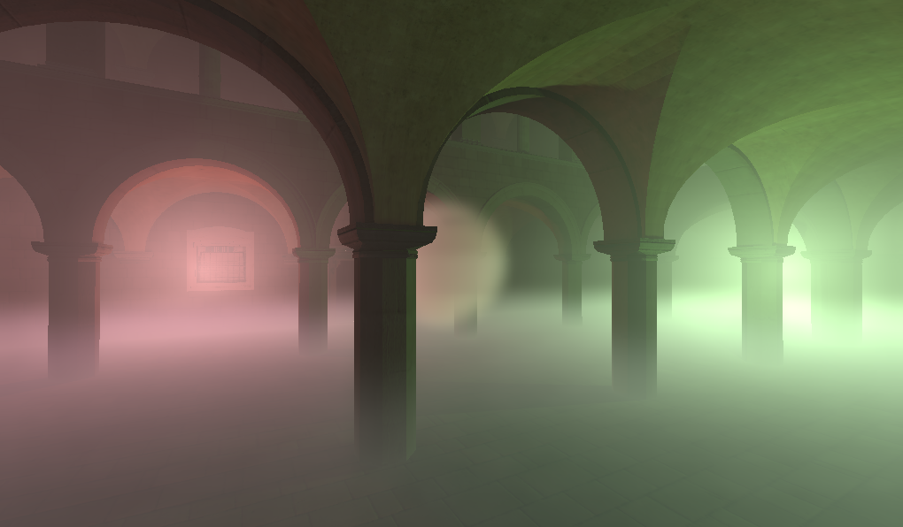

# Godot Volumetrics Plugin



Hello fellow Godot user. This plugin will enable to create well lit volumetric fog in the game engine. **GLES 3 only**.

## What is it exactly?

Well as you may know, there are different ways of achieving volumetric effects; each one has their one advantages and disadvantages.

* **Analytic fog** :- An oldy but a goody, this blends a solid colour onto the scene based on depth, and sometimes height. It's easy to calculate, but usually doesn't interact with lights in the scene.

* **Billboard sprites** :- Semi-transparent sprites that always face the viewer can do a good job of simulating fire, clouds and smoke. The illusion can break however if viewed from multiple angles, or intersects any geometry, revealing the true nature of the billboard sprites.
* **Raymarching** :- Doing what offline ray-tracers have always done, this technique is pretty versatile and allows you to render a bunch of volumetric effects. Like an offline ray-tracer however, it can be pretty slow when implemented naively.
* **Voxel-based volumetric fog** :- The technique implemented here.

This technique, based on [frostbite's implementation](https://www.ea.com/frostbite/news/physically-based-unified-volumetric-rendering-in-frostbite), uses a bunch of frustum-aligned 3D textures to hold the participating media in clip-space. This media is then used to calculate lights in 3D space in a more unified manner. Local fog can easily be blended with each other, global fog, and to an extent in this case, transparent objects.

## Installation

Whether it's downloaded from the asset library, or directly from the GitHub repo, you must retrieve the `silicon.vfx.volumetrics` folder inside the `addons` folder, and put it into _your_ `addons` folder. If you don't have one, make one. After that, you go into your `Project Settings` to enable the addon, and you'll be good to go. 

**Note:** you may have some errors involving some nodes not being found; don't worry. Those errors mean nothing and your project will work as usual.

## How to use

### Volumetric Fog

To start adding volumetric fog to your scene, you need to first add a `VolumetricFog` node to your scene (**One per viewport**). This node holds the properties responsible for _how_ volumes in the scene get rendered.

* `Start`:- The closest point to where volumes appear.
* `End` :- The _farthest_ point to where volumes appear.
* `Tile Size` :- The size of each tile in the 3D textures used to render the effect. A smaller number allows finer detail, but can **severely** reduce performance.
* `Samples` :- The number of layers used to render the volumes. A larger number allows more detail along the _depth_ of the scene, but can reduce performance.
* `Distribution` :- How much the volume layers get packed close to the `Start` distance. A value of zero means equal distribution, while a value of one distributes the layers closer to the viewer, giving more detail close up than farther away.
* `Temporal Blending` :- How much the effect blends with the previous frame. A higher value can smooth the effect more, but is more susceptible to ghosting artifacts. Setting it to zero disables blending altogether.
* `Volumetric Shadows` :- Enabling this allows volumes in view to cast shadows on themselves (Not on geometry though).
* `Shadow Atlas Size` :- How much resolution is used to render the shadows of lights. **Does not affect `Volumetric Shadows`**.
* `Ambient Light Color` :- The color of the ambient light applied to volumes.
* `Ambient Light Energy` :- How much the ambient light is applied to volumes.

### Volume Proxy

After you've added the node mentioned above, the `VolumeProxy` node should now work for you and can be added to the scene. It has two properties.

* `Material` :- Determines the apparent properties of the volume.
* `Bounds Mode` :- The shape of volume's borders
  * `Global` :- No borders at all. Only _one_ `VolumeProxy` can be global at a time.
  * `Local Box` :- The border's shaped like a cuboid.
  * `Local Sphere` :- The border's shaped like an ellipsoid.
* `Extents` :- The region in which the volume is rendered (with a local bounds mode).
* `Bounds Fade` :- How faded the bounds of the volume is.

### Volumetric Material

`VolumeProxys` use a `VolumetricMaterial` to change the way they appear. They are pretty basic right now, but should do for most practical situations. They have the following properties.

* `Scatter Color` :- The color of the volume.
* `Density` :- How thick the volume is.
* `Scatter Texture` :- A texture applied to the volume's color.
* `Absorption Color` :- The color appears as light get's absorbed by the volume. Visible when used in conjunction with `Volumetric Shadows`.
* `Anisotropy` :- How light is scattered through the volume. Positive values tend to scatter light towards the viewer, while negative scatters light _away_ from the viewer.
* `Emission Enabled` :- Whether to use emission in the volume.
* `Emission Color` :- The color of the emission in the volume.
* `Emission Strength` :- How strong the emission is.
* `Emission Texture` :- A texture applied to the volume's emission.
* `Uvw Scale` :- The scale factor of the uvw texture coordinates.
* `Uvw Offset` :- The offset of the uvw texture coordinates.

## 3D Texture Creator


The plugin comes with a 3D Texture Creator so that you can easily give a little life to your fog volumes. More specifically, you can generate 3D noise textures. You can find this tool under `Project -> Tools -> Create 3D Texture...`. 


After setting up the texture (Each label has a tooltip for you), press the `Create Texture` button to save the texture to a location. If you're not overriding an existing texture, then you'll have to close and open the engine window to refresh the file manager. Then select the texture and setup the slices (you get the numbers from the texture creator). If the texture is being created for the first time, then it would be imported as a regular texture. You would need to manually reimport it as a `Texture3D` and restart the editor. And just like that, you should now have a 3D texture to use in your fog. :)

## Demo


The project comes with a demo to see what can be done with the plugin. You look around with the mouse and move with the arrow keys. To see your mouse again, press the `Esc` key. Each setting on the top right has a tooltip to tell you about what they do.

## Other stuff

By default, all lights added to the scene affect volumes at the same strength, but you can adjust this strength for each individual light. Each one should now have a `Volumetric Energy` parameter. This can be used to strengthen or weaken the volumetric effect the light has, without changing the energy the light contributes to real geometry. If you want to do it by script then you must set it as a meta value.

```GDScript
set_meta("volumetric", energy_you_wanna_set_as)
```

Speaking of geometry, transparent geometries do not blend with volumetrics by default. You need to enable `Apply Volumetrics` to do that. The support is quite limited though, as only _some_ of the material properties are supported. The ones that are supported are: `Material Override`, `Material` in `CSGPrimitives`, and `Materials` in `MeshInstances`(Not to be confused with the material inside meshes). Like `Volumetric Energy`, this too is set as a meta value.

```GDScript
set_meta("apply_volumetrics", wanna_apply_it)
```

## Special Thanks

As stated at the start, this project is based on frostbite's approach to volumetric fog, but I also based my code off of how blender achieved it, and also, I was inspired to start this in the first place by [danilw's Volumetric Light demo](https://github.com/danilw/godot-utils-and-other/tree/master/Volumetric_Lights) :).